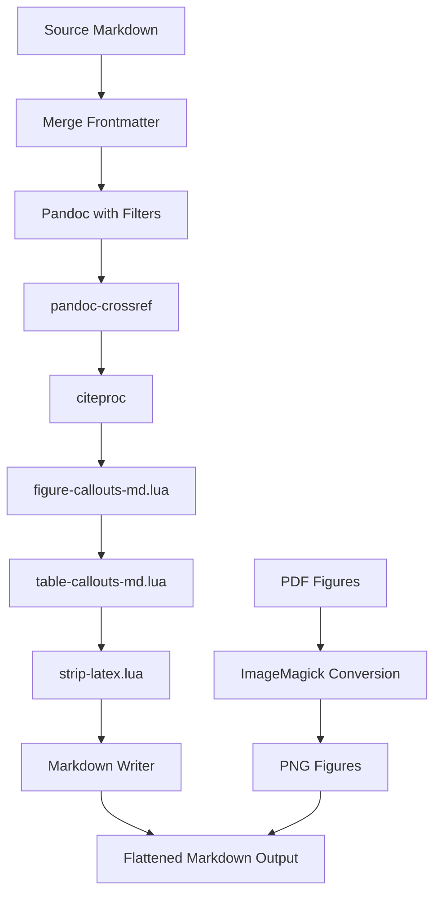

# Flattened Markdown Export for Digital Garden

## Overview

This plan describes the implementation of a new export feature that produces a "flattened" markdown file optimized for digital gardens and web publishing. The output will have all pandoc-crossref references resolved, citations rendered with bibliography, figures/tables converted to standard markdown, and LaTeX-specific code removed.

## Requirements Summary

| Requirement | Implementation |
|-------------|----------------|
| Cross-references | Resolved to plain text (e.g., `Figure 1`) |
| Citations | Rendered inline with bibliography at end |
| Citation style | User-selectable CSL style |
| Figures | Standard markdown: `` |
| Tables | Standard markdown tables with caption |
| Figure format | PNG/web quality with options for background |
| LaTeX code | Removed or converted to markdown equivalents |
| Math equations | Kept as-is (`$...$` and `$$...$$`) |
| Target platform | Digital gardens (Vercel, Quartz, etc.) |

---

## Architecture



---

## Implementation Components

### 1. New Lua Filter: `figure-callouts-md.lua`

**Purpose**: Convert Obsidian-style figure callouts to standard markdown images for markdown output.

**Input**:
```markdown
> [!figure] #fig:results width=80% align=left
> 
>
> **Example Figure.** Lorem ipsum dolor sit amet.
```

**Output**:
```markdown

```

**Key Logic**:
- Parse the `[!figure]` callout block
- Extract the label (e.g., `#fig:results`)
- Extract the image path and convert `.pdf` to `.png`
- Extract caption text (everything after the image)
- Generate standard markdown image with caption as alt text
- Track figure numbering for cross-reference resolution

### 2. New Lua Filter: `table-callouts-md.lua`

**Purpose**: Convert Obsidian-style table callouts to standard markdown tables with captions.

**Input**:
```markdown
> [!table] #tbl:data width=80% align=left
>
> **Example Table.** Results summary.

| Group | Mean | P-value |
|-------|------|---------|
| Control | 12.5 | - |
```

**Output**:
```markdown
**Table 1. Example Table.** Results summary.

| Group | Mean | P-value |
|-------|------|---------|
| Control | 12.5 | - |
```

**Key Logic**:
- Parse the `[!table]` callout block
- Extract label and caption
- Remove all LaTeX-specific options (width, fontsize, spacing, etc.)
- Output caption as bold text above the table
- Keep the markdown table as-is

### 3. New Lua Filter: `strip-latex.lua`

**Purpose**: Remove or convert LaTeX-specific code to markdown equivalents.

**Elements to Handle**:

| LaTeX Element | Action |
|---------------|--------|
| `` `\setlength{...}`{=latex} `` | Remove entirely |
| ```` ```{=latex} ... ``` ```` | Remove block |
| `::: {=latex} ... :::` | Remove block |
| `\begin{landscape}...\end{landscape}` | Remove wrapper, keep content |
| `::: {custom-style="..."}` | Remove wrapper, keep content |
| `<font color="...">text</font>` | Convert to `**text**` or keep as HTML |
| `==highlighted==` | Keep as-is (many platforms support this) |

### 4. Modifications to `build.py`

**New Profile**: `md-flattened.yaml`

```yaml
# md-flattened.yaml - Flattened markdown for digital gardens
profile:
  name: "Flattened Markdown"
  description: "Web-ready markdown with resolved references"
  format: md

reader: markdown+mark+raw_html+raw_tex+implicit_figures

writer: markdown+pipe_tables+raw_html

filters:
  - resources/figure-callouts-md.lua
  - resources/table-callouts-md.lua
  - pandoc-crossref
  - citeproc
  - resources/strip-latex.lua

wrap: none
columns: 10000

metadata:
  link-citations: false
  figureTitle: "Figure"
  tableTitle: "Table"
  figPrefix: ["Figure", "Figures"]
  tblPrefix: ["Table", "Tables"]
```

**New Function**: `build_flattened_markdown()`

```python
def build_flattened_markdown(
    source_file: str,
    frontmatter_file: Optional[str] = None,
    citation_style: Optional[str] = None,
    figure_format: str = "png",  # png, webp, original
    figure_background: str = "white",  # white, transparent
    include_si_refs: bool = False,
    si_file: Optional[str] = None
):
    """Build flattened markdown for digital garden export."""
    pass
```

**New CLI Arguments**:
```
--flatten              Export as flattened markdown
--figure-format=FORMAT Figure format: png, webp, original (default: png)
--figure-bg=COLOR      Figure background: white, transparent (default: white)
```

### 5. Figure Conversion Enhancement

**Current**: `convert_figures_to_png()` - basic conversion

**Enhanced**: `convert_figures_for_web()`

```python
def convert_figures_for_web(
    format: str = "png",
    background: str = "white",
    quality: int = 90,
    density: int = 300
):
    """Convert PDF figures to web-friendly formats.
    
    Args:
        format: Output format (png, webp, jpg)
        background: Background color (white, transparent, or hex color)
        quality: JPEG/WebP quality (1-100)
        density: DPI for PDF rasterization
    """
    figures_dir = Path("figures")
    if not figures_dir.exists():
        return
    
    for pdf_file in figures_dir.glob("*.pdf"):
        output_file = pdf_file.with_suffix(f".{format}")
        
        cmd = ["magick", "-density", str(density)]
        
        if background == "transparent":
            cmd.extend(["-background", "none", "-alpha", "set"])
        else:
            cmd.extend(["-background", background, "-alpha", "remove"])
        
        cmd.extend([str(pdf_file), str(output_file)])
        
        subprocess.run(cmd, capture_output=True, check=False)
```

### 6. Obsidian Plugin UI Additions

**New Export Option in Build Modal**:

```typescript
// Add to BuildConfig interface
interface BuildConfig {
    // ... existing fields ...
    exportFormat: "pdf" | "docx" | "latex" | "markdown";
    figureFormat: "png" | "webp" | "original";
    figureBackground: "white" | "transparent";
}

// Add new section in BuildModal
private addFlattenedMarkdownOptions(containerEl: HTMLElement) {
    new Setting(containerEl)
        .setName("Export Format")
        .setDesc("Choose output format")
        .addDropdown(dropdown => {
            dropdown
                .addOption("pdf", "PDF")
                .addOption("docx", "Word")
                .addOption("latex", "LaTeX")
                .addOption("markdown", "Flattened Markdown")
                .setValue(this.config.exportFormat)
                .onChange(value => {
                    this.config.exportFormat = value;
                    this.updateVisibility();
                });
        });
    
    // Show these only when markdown is selected
    if (this.config.exportFormat === "markdown") {
        new Setting(containerEl)
            .setName("Figure Format")
            .addDropdown(dropdown => {
                dropdown
                    .addOption("png", "PNG")
                    .addOption("webp", "WebP")
                    .addOption("original", "Keep Original")
                    .setValue(this.config.figureFormat);
            });
        
        new Setting(containerEl)
            .setName("Figure Background")
            .addDropdown(dropdown => {
                dropdown
                    .addOption("white", "White")
                    .addOption("transparent", "Transparent")
                    .setValue(this.config.figureBackground);
            });
    }
}
```

---

## Detailed Filter Specifications

### `figure-callouts-md.lua` - Full Specification

```lua
-- figure-callouts-md.lua
-- Converts Obsidian figure callouts to standard markdown for web output

local figure_counter = 0
local figure_labels = {}  -- Maps labels to numbers

-- First pass: collect all figure labels and assign numbers
function collect_figures(doc)
    for _, block in ipairs(doc.blocks) do
        if is_figure_callout(block) then
            local label = extract_label(block)
            if label then
                figure_counter = figure_counter + 1
                figure_labels[label] = figure_counter
            end
        end
    end
end

-- Convert figure callout to standard markdown
function BlockQuote(block)
    if not is_figure_callout(block) then
        return nil
    end
    
    local header = stringify(block.content[1])
    local label = header:match("#(fig:[%w%-_]+)")
    local fig_num = figure_labels[label] or "?"
    
    -- Extract image path
    local img_path = extract_image_path(block)
    -- Convert .pdf to .png
    img_path = img_path:gsub("%.pdf$", ".png")
    
    -- Extract caption
    local caption = extract_caption(block)
    
    -- Build alt text: "Figure N. Caption"
    local alt_text = string.format("Figure %d. %s", fig_num, caption)
    
    -- Return standard markdown image
    return pandoc.Para({
        pandoc.Image({pandoc.Str(alt_text)}, img_path, "")
    })
end

-- Resolve cross-references to plain text
function Cite(cite)
    -- Handle @Fig:label references
    for _, citation in ipairs(cite.citations) do
        local id = citation.id
        if id:match("^[Ff]ig:") then
            local label = "fig:" .. id:match("^[Ff]ig:(.+)$")
            local num = figure_labels[label]
            if num then
                return pandoc.Str("Figure " .. num)
            end
        end
    end
    return nil  -- Let citeproc handle other citations
end
```

### `strip-latex.lua` - Full Specification

```lua
-- strip-latex.lua
-- Removes LaTeX-specific code from markdown output

-- Remove raw LaTeX blocks
function RawBlock(block)
    if block.format == "latex" or block.format == "tex" then
        return {}  -- Remove entirely
    end
    return nil
end

-- Remove inline raw LaTeX
function RawInline(inline)
    if inline.format == "latex" or inline.format == "tex" then
        return {}  -- Remove entirely
    end
    return nil
end

-- Handle Div elements with custom styles or latex attributes
function Div(div)
    -- Remove {=latex} divs
    if div.classes:includes("latex") then
        return {}
    end
    
    -- Remove custom-style wrappers but keep content
    if div.attributes["custom-style"] then
        return div.content
    end
    
    return nil
end

-- Handle CodeBlock with {=latex} attribute
function CodeBlock(block)
    if block.classes:includes("latex") then
        return {}
    end
    return nil
end

-- Convert font color tags to bold (or keep as HTML)
function Span(span)
    if span.attributes.color then
        -- Option 1: Convert to bold
        -- return pandoc.Strong(span.content)
        
        -- Option 2: Keep as HTML for web
        local color = span.attributes.color
        local content = pandoc.utils.stringify(span.content)
        return pandoc.RawInline("html", 
            string.format('<span style="color:%s">%s</span>', color, content))
    end
    return nil
end
```

---

## File Structure After Implementation

```
md-manuscript/
├── resources/
│   ├── figure-callouts.lua          # Existing (for PDF/LaTeX)
│   ├── figure-callouts-md.lua       # NEW (for markdown output)
│   ├── table-callouts.lua           # Existing (for PDF/LaTeX)
│   ├── table-callouts-md.lua        # NEW (for markdown output)
│   ├── strip-latex.lua              # NEW (remove LaTeX code)
│   ├── color-text.lua               # Existing
│   └── profiles/
│       ├── _base.yaml
│       ├── md-flattened.yaml        # NEW profile
│       └── ... (existing profiles)
├── build.py                          # Modified with new functions
└── obsidian-manuscript-build/
    └── src/
        └── main.ts                   # Modified with new UI options
```

---

## Testing Plan

### Unit Tests for Lua Filters

1. **Figure Callout Conversion**
   - Single figure with all options
   - Multiple figures with cross-references
   - Figures without labels
   - PDF to PNG path conversion

2. **Table Callout Conversion**
   - Table with caption
   - Table with all options (width, fontsize, etc.)
   - Landscape table wrapper removal

3. **LaTeX Stripping**
   - Inline LaTeX commands
   - LaTeX code blocks
   - Custom-style divs
   - Mixed content preservation

### Integration Tests

1. **Full Document Export**
   - Export sample manuscript to flattened markdown
   - Verify all references resolved
   - Verify bibliography rendered
   - Verify figures converted

2. **Digital Garden Compatibility**
   - Test output in Quartz
   - Test output in Obsidian Publish
   - Verify image paths work

---

## Implementation Order

1. **Phase 1: Core Filters**
   - Create `figure-callouts-md.lua`
   - Create `table-callouts-md.lua`
   - Create `strip-latex.lua`

2. **Phase 2: Build System**
   - Create `md-flattened.yaml` profile
   - Add `build_flattened_markdown()` to `build.py`
   - Add CLI arguments for flatten options

3. **Phase 3: Figure Conversion**
   - Enhance `convert_figures_for_web()` function
   - Add background color options
   - Add format options (PNG, WebP)

4. **Phase 4: Obsidian Plugin**
   - Add export format dropdown
   - Add figure format options
   - Add figure background options
   - Wire up to build command

5. **Phase 5: Testing & Documentation**
   - Test with sample documents
   - Update README.md
   - Update WRITING.md

---

## Open Questions / Decisions

1. **Frontmatter Handling**: Should YAML frontmatter be preserved, stripped, or converted?
   - Recommendation: Strip or convert to a simple header

2. **Internal Links**: How to handle `[[wiki-links]]` if present?
   - Recommendation: Convert to standard markdown links

3. **Embedded Files**: How to handle `![[embedded.md]]` syntax?
   - Recommendation: Expand inline or convert to link

4. **Output Location**: Same `export/` folder or separate `export/web/`?
   - Recommendation: `export/` with `.md` extension
